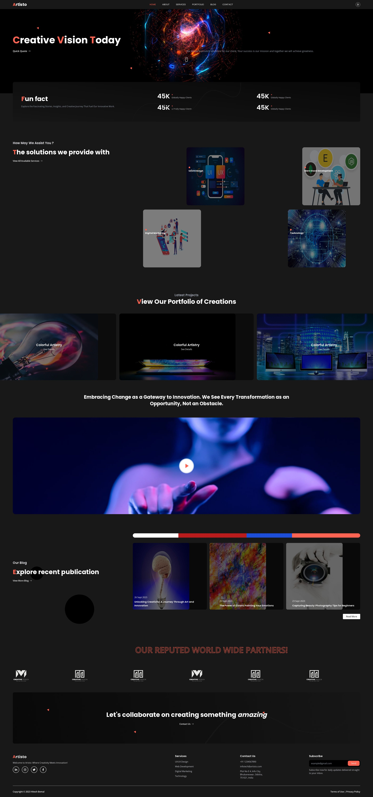

# Aristo Creative Agency Website



Welcome to the Aristo Creative Agency website repository! This project showcases the power of React.js and Tailwind CSS to create a modern and visually appealing creative agency website.

## Table of Contents

- [About](#about)
- [Features](#features)
- [Tech Stack](#tech-stack)
- [Getting Started](#getting-started)

## About

The Aristo Creative Agency website is a dynamic and responsive web application designed to help creative agencies showcase their portfolio, services, and engage with potential clients. It combines the flexibility of React.js for building interactive user interfaces with the utility-first CSS framework, Tailwind CSS, to create a visually stunning and performant website.

## Features

- **Responsive Design**: Ensure a seamless user experience across various devices and screen sizes.
- **Portfolio Showcase**: Display your agency's best work with style and elegance.
- **Services Section**: Describe your services and expertise.
- **Contact Form**: Allow users to get in touch easily.
- **Smooth Animations**: Enhance the user experience with subtle animations.
- **Customizable**: Easily customize content, images, and styles to match your agency's branding.

## Tech Stack

- **React.js**: A popular JavaScript library for building user interfaces.
- **Tailwind CSS**: A utility-first CSS framework for building responsive and customizable designs.
- **Other Dependencies**: List any other major dependencies or libraries used.

## Getting Started

To get started with this project on your local machine, follow these steps:

1. Clone the repository:

   ```shell
   git clone https://github.com/Hiteshbemal24/Aristo-Creative-Agency-Website.git

2. Install dependencies:
     ```shell
     cd aristo-creative-agency
     npm install

3. Start the development server:
     ```shell
     npm start
4. Open your web browser and navigate to http://localhost:5173 to view the website.


